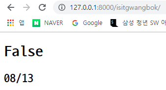
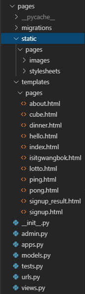
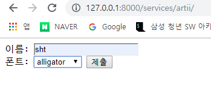
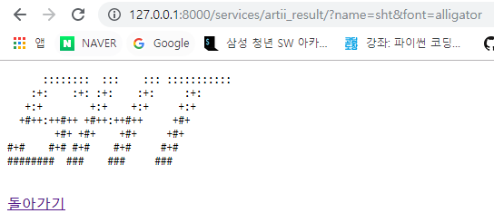

# Django 수업 정리

##  isitgwangbok

오늘이 광복절인지 여부를 나타내는 웹 페이지

### 1) url 정의

```python
path('isitgwangbok/', views.isitgwangbok),
```


### 2) View 정의

```python
def isitgwangbok(request):
    now = datetime.datetime.now() # now에 현재 시간 저장
    if now.month == 8 and now.day == 15: # 월이 8, 일이 15인지 확인하여 결과 저장
        result = True
    else:
        result = False
    context = {	# context에 result 저장
        'result' : result
    }
    return render(request, 'isitgwangbok.html', context)
```


### 3) 템플릿 정의

(REAME.md의 dinner 참조)

```html
<body>
  <h1>{{ result }}</h1>
  <h2></h2>
      <!-- now 현재 시간
    `m/d`을 통해 월/일 출력
    =>django 문법(Built-in tags)
    'Y/m/d'로 하면 연/월/일 출력
 -->
</body>
```


### 4) 서버 실행 및 확인

```bash
$ python manage.py runserver
```




## ping / pong으로 신호 주고 받기

### 1) url 정의

```python
path('ping/', views.ping)
path('pong/', views.pong)
```


## 새로운 어플 만들기

### 1) 새로운 어플 생성

```bash
$ python manage.py startapp services
```

### 2) service 어플 등록

```python
# first_django/settings.py

..
INSTALLED_APPS = [
    ..,
    'services',
    ..
]
```


### 3) urlpatterns 분리

* 어플 모음

```python
# first_django/urls.py

from django.urls import path, include # include 추가

urlpatterns = [
    ..
    path('pages/', include('pages.urls')), # include로 각각의 어플 추가
    path('services/', include('services.urls')),
]
```

* pages url 모음

```python
# first_django/pages/urls.py

from django.urls import path
from . import views # 같은 디렉토리(.)에서 views를 가져오겠다.

urlpatterns = [
    # 1. url 설정
    # path(url, 해당하는 views의 함수)
    path('', views.index),
    # variable routing
    # url의 특정 값을 변수처럼 활용
    path('hello/<str:name>/', views.hello),
    path('lotto/', views.lotto),
    path('dinner/', views.dinner),
    path('cube/<int:number>/', views.cube),
    path('about/<str:name>/<int:age>/', views.about),
    path('isitgwangbok/', views.isitgwangbok),
    path('ping/', views.ping),
    path('pong/', views.pong),
    path('signup/', views.signup),
    path('signup_result/', views.signup_result),
]
```

* services url 모음

```python
# first_django/services/urls.py

from django.urls import path
from . import views

urlpatterns = [
    path('', views.index),
]
```

* 충돌 방지

똑같은 이름을 가진 템플릿 간의 충돌을 막기 위해 앱 이름안에 템플릿츠 폴더 안에 앱 이름으로 폴더를 생성하여 템플릿을 모아넣는다. Django는 실질적으로 템플릿을 한 곳에 모아놓고 동작한다.

ex) pages > static > pages >  images

​	  pages > templates > pages



### 4) views 경로 수정

* 기존

```python
# first_django/pages/templates/pages/views.py

def index(request):
    # 2. >> 로직 작성 <<
    # 3. 해당하는 템플릿 반환
    return render(request, 'index.html')
```

* 수정 후

```python
# first_django/templates/views.py
# 가장 상위 링크에 생성(first_django/templates)

def index(request):
    # 2. >> 로직 작성 <<
    # 3. 해당하는 템플릿 반환
    return render(request, 'pages/index.html') # pages가  추가됨
```


## 템플릿 상속

템플릿 간의 상속을 받아서 중복되는 양식이 있으면 더 효율적으로 작성할 수 있음.

- base url을 사용할 수 있도록 디렉토리 설정

```python
# first_django/setting.py

...
TEMPLATES = [
    ...
    'DIRS':[
        # BASE_DIR은 16번째 줄에 정의된 변수 - 현재 프로젝트 폴더 위치를 뜻한다.
        # first-django-project 폴더임.
        # first-django-project/first_django/templates/ 를 디렉토리에 추가하는 코드
        os.path.join(BASE_DIR, 'first_django', 'templates')
    ]
]
...
```


* 기본 양식 템플릿

```html
<!-- services/templates/services/base.html -->

<!DOCTYPE html>
<html lang="ko">
<head>
  <meta charset="UTF-8">
  <meta name="viewport" content="width=device-width, initial-scale=1.0">
  <meta http-equiv="X-UA-Compatible" content="ie=edge">
  <title>Django services</title>
   
</head>
<body>
  
  
</body>
</html>
```


* 응용 템플릿

```html
<!-- services/templates/services/index.html -->


<!--  -->
<!-- base_url이 services가 아닌 상위 폴더로 이동했으므로 services를 지움-->


<style>
h1 {
  color: blueviolet;
}
</style>



<h1>서비스 목록!</h1>

```

로 생성해서  으로 끝냄

* **html 이면 주소 앞에 / 붙이고, py이면 주소 앞에 / 붙이지 않는다.**


## Artii 글자 생성하기

### 1) url 정의

```python
# first_django/services/urls.py

from django.urls import path
from . import views


urlpatterns = [
    path('', views.index),
    
    path('artii/', views.artii),
    path('artii_result/', views.artii_result),
]
```


### 2) View 정의

```python
# first_django/services/views.py

from django.shortcuts import render
import requests

...

def artii(request):
    return render(request, 'services/artii.html')

    
def artii_result(request):
    name = request.GET.get('name')
    font = request.GET.get('font')
    url = f'http://artii.herokuapp.com/make?text={name}&font={font}'
    response = requests.get(url).text
    # requests.get(url)만 하면 <response[200]>이라는 이상한 결과가 나오기 때문에 뒤에 .text를 붙여 text형태로 만들어서 저정한다.
    context = {
        'response' : response
    }
    return render(request, 'services/artii_result.html', context)
```


### 3) 템플릿 정의

#### (1) artii.html

```html
<!-- services/templates/services/artii.html -->

...
<body>
  <form action="/services/artii_result/">
    <label for="name">이름: </label>
    <input id="name" type="text" name="name"><br>
    <label for="font">폰트: </label>
    <!-- select를 통해 여러 항목 중 선택 가능하게 함 -->
    <select name="font" id="font">
      <option value="rounded">rounded</option>
      <option value="acrobatic">acrobatic</option>
      <option value="alligator">alligator</option>
      <option value="short">short</option>
      <option value="type_set">type_set</option>
    </select>
    <input type="submit" value="제출">
  </form>
</body>
...
```


#### (2) artii_result.html

```html
<!-- services/templates/services/artii_result.html -->

...
<body>
  <pre>{{ response }}</pre>
  <!-- pre 태그는 입력한 형태 그대로 보여줌 -->
  <br>
  <a href="/services/artii/">돌아가기</a>
</body>
...
```


### 4) 결과

#### (1) artii.html



#### (2) artii_result.html



