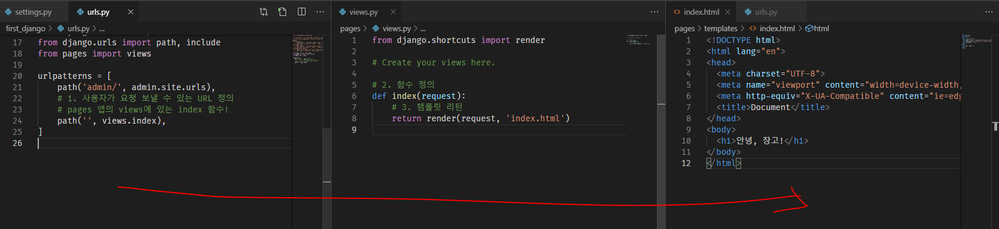

# Django

장고라 발음한다, 디장고 아님


## 성격

Opinionated(다소 독선적)

자유분방하게 할 수 있는 것이 적다


## 프레임워크

* framework => 어떤 서비스를 만들때 사용되는 소스 코드의 집합

  ex) django

* library => framework등에서 특정 기능만을 수행하기 위한 소스 코드들

   framework와 비슷한 듯하면서도 다름

  ex) bootstrap


## Dynamic Web

**서버사이드 동적 웹페이지**(server-side dynamic web page)는 서버사이드 스크립트를 처리하는 [애플리케이션 서버](https://ko.wikipedia.org/wiki/애플리케이션_서버)에 의해 통제되는 구조의 [웹페이지](https://ko.wikipedia.org/wiki/웹페이지)이다. 서버 사이드 스크립트에서 파라미터는 클라이언트 사이드 처리의 구성을 포함하여, 새로운 모든 웹 페이지의 조합이 어떻게 처리되는지를 결정한다.

**클라이언트 사이드 동적 웹페이지**(client-side dynamic web page)는 로드될 때 브라우저에서 실행되는 [HTML 스크립트](https://ko.wikipedia.org/w/index.php?title=HTML_스크립트&action=edit&redlink=1)를 사용하여 웹 페이지를 처리한다. 자바스크립트와 다른 스크립트 언어들은 수신된 페이지의 HTML이 [문서 객체 모델](https://ko.wikipedia.org/wiki/문서_객체_모델)(DOM)로 구문 분석하는 방식을 결정하며 로드되는 웹 페이지를 표출한다. 동일한 클라이언트 사이드 기법들이 동일한 방식으로 DOM을 동적으로 업데이트하거나 변경한다.


## MTV

Model : 데이터를 관리

Template : 사용자가 보는 화면

View : 중간 관리자


## 한국어/ 한국 시간 설정

`settings.py`에서 맨 밑에 있는 LAGUAGE_CODE = 'ko-kr'로 설정하고, TIME_ZONE='Asia/Seoul' 로 수정


## 기타

urls.py : url 정의

views.py : 함수 정의

templates/__.html : 템플릿 정의


## 1. 시작하기

### 0. 가상환경 실행 + .gitignore

> 가상환경을 사용하는 이유는 프로젝트마다 활용되는 라이브러리가 다르고, 동일한 라이브러리더라도 버전이 다를 수 있다.
>
> 따라서, 프로젝트 하면서 라이브러리 삭제 혹은 변경을 하는 것이 아니라 각 프로젝트마다 독립된 가상환경을 부여하여 의존성을 없앤다.
>
> 항상 django 실행할 때 마다 가상환경을 활성화 시키는 것을 습관화 하자!
>
> 추후에 Data Science/ Machine Learning/ Deep Learning 학습 시에는 anaconda를 활용하기도 한다!

가상환경은 python에서 기본으로 제공하고 있는 [`venv`](https://docs.python.org/ko/3/tutorial/venv.html)를 활용한다. (python 3.5+)

1. 가상환경 생성

   원하는 디렉토리에서 아래의 명령어를 입력한다.

   ```bash
   $ python -m venv __venv__ # __ 뺴고 써야함
   ```

   - `__venv__` 여기에 가상환경 이름을 작성하는데, 보통 `venv`라고 설정한다.
   - `__venv__` 폴더가 생성되는데, 구조는 다음과 같다.
     - `Lib` : 가상환경에 설치된 라이브러리 모음.
     - `Scripts`: 가상환경 실행과 관련된 파일

2. 가상환경 실행

   ```bash
   $ ls
   venv ... # venv 폴더가 반드시 있어야 함
   
   $ source venv/Scripts/activate
   (venv)
   $ python -V
   Python 3.7.4
   ```

   - 반드시 해당 명령어는 `venv` 폴더가 있는 곳에서 실행시킨다.
   - **`bash shell`에서는 `activate` 파일을 실행하여야 한다.**
     - `cmd` : `activate.bat`
     - `power shell` : `activate.psl`

3. 가상환경 종료

   ```bash
   $ deactivate
   ```

4. `.gitignore` 등록

   ```shell
   venv/
   ```

   - 추가적으로 visual studio code를 활용하는 경우에는 `.vscode/`
   - python 환경에서는 `__pycache__/`
   - pycharm 환경에서는 `.idea/`

   위의 폴더들은 `.gitignore`에 등록하는 습관을 가지자! 잘 모르겠으면 [gitignore.io](https://gitignore.io)에서 찾아서 복사하자 :)
   
5. django 설치

```bash
$ pip install django
```

* 현재 활용하고 있는 버전은 다음과 같다.
  * python 3.7.4
  * django 2.2.4


### 1. Django 프로젝트 시작

```bash
$ mkdir __프로젝트 이름 or 폴더 이름 __
$ cd __프로젝트 이름 or 폴더 이름__
```

```bash
$ django-admin startproject __프로젝트이름__ . # 점 반드시 써야함
```
**프로젝트 이름 뒤에 뛰어 쓰기를 하고 점(.)을 써야함.**

* 프로젝트 이름으로 구성된 폴더와, manage.py가 생성된다.
  * `__init__.py` : 해당 폴더가 패키지로 인식될 수 있게끔 작성되는 파일
  * `settings.py` : **django 설정과 관련된 파일**
  * `urls.py` : **url 관리**
  * `wsgi.py` : 배포시 사용(web server gateway interface : 파이썬에서 사용되는 웹 서버)
  * `manage.py` : django 프로젝트와 관련된 커맨드라인(명령어) 유틸리티

### 2. 서버 실행

```bash
$ python manage.py runserver
```

* `localhost:8000` 으로 들어가서 로켓 확인!


### 3.  App 생성

```bash
$ python manage.py startapp __app이름__
```

* `app이름`인 폴더가 생성되며, 구성하고 있는 파일은 다음과 같다.

  * `admin.py` : 관리자 페이지 설정

  * `apps.py` : app의 정보 설정. 직접 수정하는 경우 별로 없음.

  * `models.py` : **MTV-Model을 정의하는 곳**

  * `tests.py` : 테스트 코드를 작성하는 곳.

  * `views.py` : **MTV-View를 정의하는 곳.**

    * 사용자에게 요청이 왔을 때, 처리되는 함수

      ```python
      def index(request):
          return render(request, index.html)
      ```

**app을 만들고 나서 반드시 `settings.py`에서 `INSTALLED_APPS`에 app을 등록한다.**

```python
# first_django/settings.py
# ..
INSTALLED_APPS = [
    'pages',
    'django.contrib.admin',
    # ...
]
#..
```


## 2. 작성 흐름



### 1. URL 정의

```python
# first_django/urls.py
from pages import views

urlpatterns = [
    path('', views.index), # django에서는 끝에 계속 콤마 쓰는 연습
]
```

* `urls.py`는 우리의 웹 어플리케이션 경로들을 모두 관리한다.
* 요청이 들어오면 `urls.py`의 `urlpatterns`에 정의된 경로에 매핑한다.
* path(`경로`, `views에 정의된 함수`)

### 2. View 정의

```python
# pages/views.py

def index(request):
    return render(request, 'index.html')
```

* `views.py`는 MTV에서 View에 해당한다.
* 일종의 중간관리자로 Model, Template 등의 처리를 담당한다.


### 3. Template 정의

* 기본적으로 app을 생성하면, `templates` 폴더가 없으므로 직접 생성해야 한다.

```html
<!-- pages/templates/index.html -->
<h1>
    장고 안녕!
</h1>
```


### 4. 서버 실행 및 확인

```bash
$ python manage.py runserver
```

`localhost:8000` 에서 확인해보자!


## 3. 정리

### 1) 폴더 만들고

mkdir __


### 2) 가상환경 만들고


python -m venv venv

2-1) .gitignore에 venv/ 추가


### 3) 가상환경 실행 후

source venv/Scripts/activate


### 4) 원하는 django 버전 설치

pip install django


### 5) 프로젝트 생성

django-admin startproject __


### 6) app 생성 및 등록


### 7) url 설정


### 8) views.py 설정


### 9) templates 설정


### 10) 서버 실행


## Tip

### 단축키 입력

```bash
source venv/Scripts/activate
```

 매번 입력하기 번거로우므로 vi ~/.bashrc 를 통하여 줄이기를 한다

**bashrc 작성시에 띄어쓰기 있으면 안됨**

```bash
vi ~/.bashrc
```

```txt
alias jn='jupyter notebook'
alias venv="source ~/python-virtualenv/3.7.4/Scripts/activate"
venv
alias activate="source venv/Scripts/activate"
```

위의 것을 입력하고 `esc`+`:wq`를 통해 저장하고 빠져나온다.

줄임말 실행전 `source ~/.bashrc` 를 통해 한번 실행하고 `activate`를 실행하면  `source venv/Scripts/activate` 를 입력한 것과 같은 효과가 난다.

